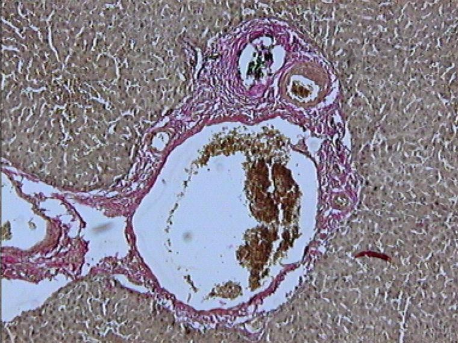
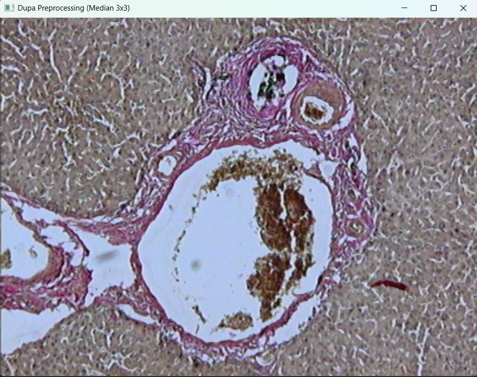
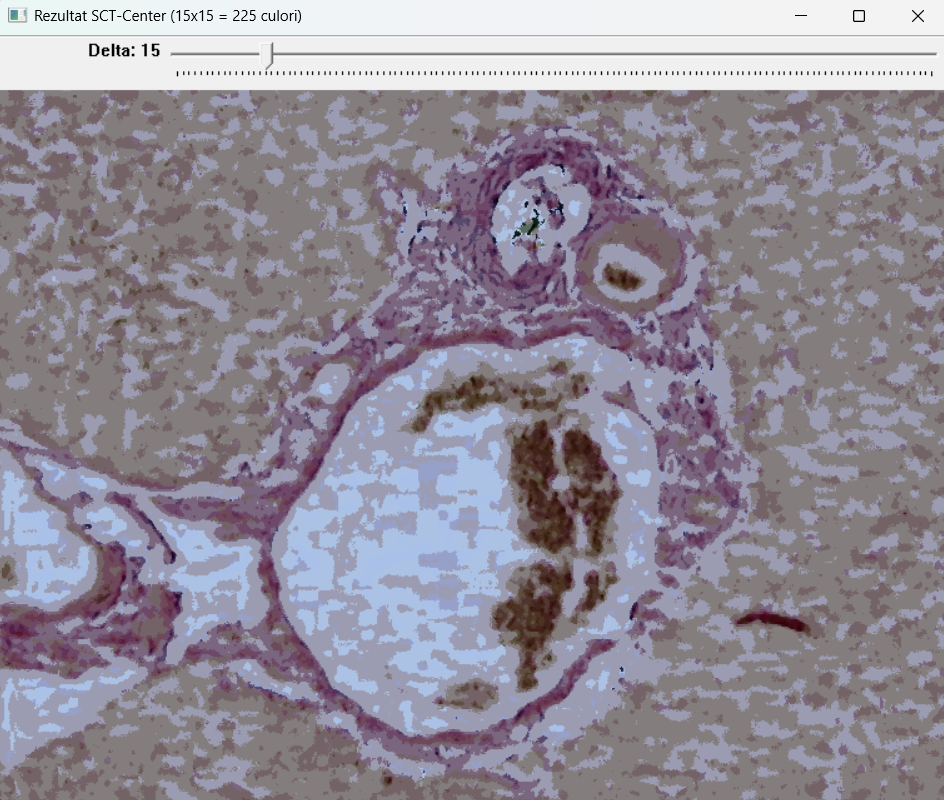
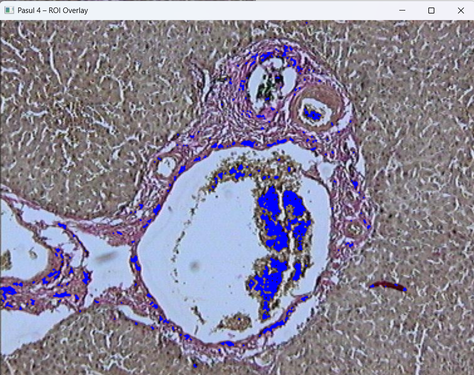
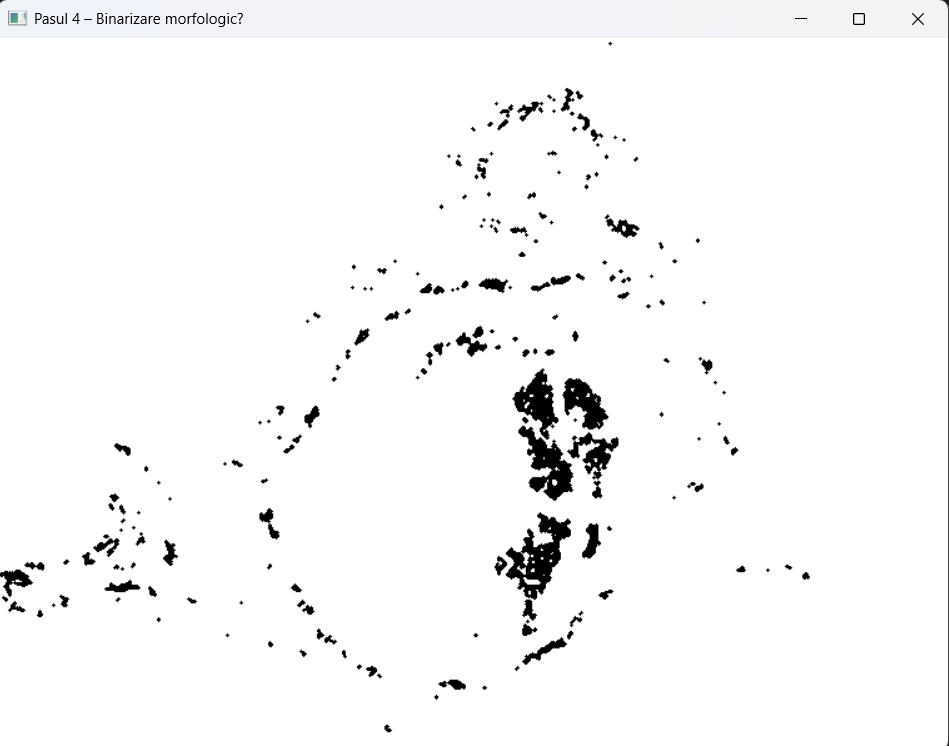

# SCT-Center Color Segmentation for Melanoma Diagnosis

A computer vision application for medical image processing that segments skin lesions using the SCT-Center (Spherical Coordinate Transform) algorithm to assist in melanoma diagnosis.

## 📋 Overview

This project implements a 5-step color segmentation algorithm specifically designed for analyzing melanoma images. The SCT-Center transformation decouples color information from brightness variations, making it robust for medical image analysis under different lighting conditions.

## 🎯 Features

- **Median Filtering**: Noise reduction with configurable kernel size
- **SCT-Center Transformation**: Advanced color space transformation (15×15 quantization = 225 colors)
- **Interactive ROI Selection**: Point-and-click interface for region of interest selection
- **Morphological Operations**: Automatic noise removal and shape refinement
- **Area Calculation**: Precise measurement of segmented regions with percentage calculations
- **Real-time Visualization**: Live preview of segmentation results

## 🚀 Algorithm Steps

### Step 1: Preprocessing
- Applies 3×3 median filter to reduce acquisition noise
- Optional color quantization from 2²⁴ to 256 colors

### Step 2: SCT-Center Color Segmentation
- Converts RGB to spherical coordinates (L, angle A, angle B)
- Maps to 15×15 quantized color space (225 total colors)
- Decouples color information from brightness variations

### Step 3: Interactive Fine-tuning
- User clicks on regions of interest
- Creates RGB cubic clusters around selected points
- Adjustable delta parameter for cluster size (0-128)
- Real-time mask updates with blue overlay

### Step 4: Morphological Filtering
- Erosion followed by dilation (opening operation)
- Uses 3×3 cross-shaped structural element
- Removes small artifacts while preserving main structure
- Generates binary mask and color overlay

### Step 5: Area Computation
- Calculates segmented area in pixels
- Computes percentage relative to total image area
- Displays results for medical analysis

## 🛠️ Technical Requirements

### Dependencies
- **OpenCV 4.x** - Computer vision library
- **Visual Studio** - C++ development environment
- **Windows OS** - Required for file dialog functionality

### Build Instructions

1. Clone the repository:
```bash
git clone https://github.com/yourusername/sct-center-melanoma-segmentation.git
cd sct-center-melanoma-segmentation
```

2. Open project in Visual Studio
3. Configure OpenCV paths in project settings
4. Build and run the application

## 📊 Usage

1. **Launch Application**: Run the executable
2. **Select Image**: Choose a melanoma image file through the dialog
3. **View Preprocessing**: Observe median filtering results
4. **Interactive Segmentation**: 
   - Click on regions of interest in the SCT-Center image
   - Adjust Delta slider for sensitivity (recommended: 15-25)
   - Continue clicking until entire lesion is covered
5. **Review Results**: 
   - Binary mask shows segmented region
   - Overlay shows original image with highlighted ROI
   - Area and percentage statistics are displayed
6. **Process Next Image**: Press any key to continue with another image

## 🎨 Visual Results

### Step-by-Step Results

#### Step 1: Preprocessing
| Before | After |
|--------|-------|
|  |  |
| Original melanoma image | After 3×3 median filtering |

#### Step 2: SCT-Center Transformation


*15×15 quantization producing 225 distinct colors*

#### Step 3: Interactive Segmentation



*Real-time ROI selection with adjustable delta parameter*

#### Steps 4-5: Morphological Filtering & Results
| Binary Mask | Color Overlay | 
|-------------|---------------|
|  |  | 
| ROI in black | Blue overlay on original | 

## 📈 Medical Applications

This tool assists dermatologists and medical professionals in:
- **Lesion Boundary Detection**: Precise segmentation of irregular melanoma shapes
- **Area Measurement**: Quantitative analysis for medical documentation
- **Color Analysis**: Identification of variegated coloring patterns
- **Diagnostic Support**: Objective measurement tools for clinical assessment

## 🔬 Algorithm Advantages

- **Lighting Independence**: SCT transformation handles varying illumination
- **Color Preservation**: Maintains critical color information for diagnosis
- **User-Guided**: Interactive selection ensures medical expertise integration
- **Morphological Refinement**: Automatic cleanup of segmentation artifacts
- **Quantitative Output**: Precise measurements for medical records

## 📝 Research Background

Based on the SCT-Center algorithm developed for variegated coloring identification in skin tumors. The spherical coordinate transformation provides superior color-brightness decoupling compared to traditional RGB analysis, making it particularly suitable for medical imaging applications.

## ⚠️ Important Notes

- This tool is designed for **research and educational purposes**
- **Not intended for clinical diagnosis** without professional medical supervision
- Results should be validated by qualified dermatologists
- Accuracy depends on image quality and proper user interaction

## 🤝 Contributing

Contributions are welcome! Please feel free to submit issues, feature requests, or pull requests.

## 📄 License

This project is licensed under the MIT License - see the [LICENSE](LICENSE) file for details.

## 📚 References

[1] Umbaugh Scott E., "Computer Vision and Image Processing", Prentice Hall, NJ, 1998.

## 📧 Contact

For questions or collaborations, please open an issue on GitHub.

---

**Keywords**: Melanoma, Medical Imaging, Color Segmentation, SCT-Center, Computer Vision, OpenCV, Skin Cancer, Image Processing
